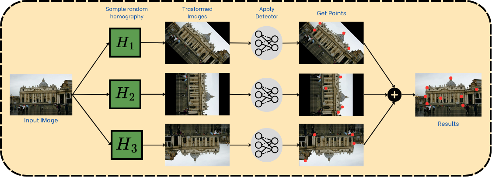
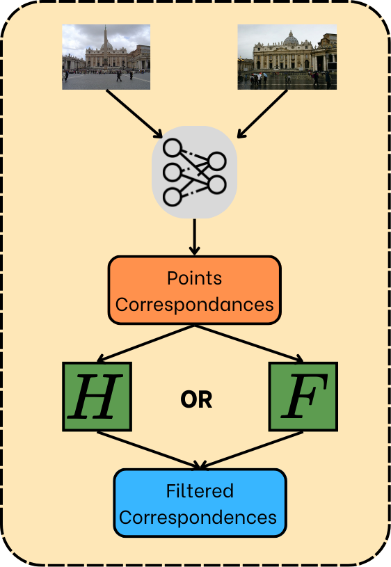
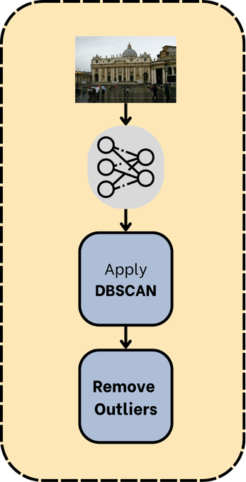

<div align="center">
  
  
  
</div>

<p align='center'>
    <h1 align="center">XFeat: Accelerated Features for Lightweight Image Matching</h1>
    <p align="center">
    Project for Advanced Computer Vision at the University of Trento A.Y.2024/2025
    </p>
    <p align='center'>
    Developed by:
    Roman Simone and Moiola Christian
    </p>   
</p>

----------


- [Project Description](#project-description)
- [Improvement](#improvement)
  - [1. XFeat Transformed](#1-xfeat-transformed)
  - [2. Feature Refinement](#2-feature-refinement)
  - [3. Semi-Dense Matching Enhancement](#3-semi-dense-matching-enhancement)
- [Installation](#installation)
- [Running the project](#running-the-project)


## Project Description

This project explores XFeat: Accelerated Features for Lightweight Image Matching, a cutting-edge lightweight architecture for image correspondence tasks, as introduced in the <a href="https://arxiv.org/abs/2404.19174">paper</a>. XFeat focuses on resource-efficient feature detection, extraction, and matching, aiming to meet the computational demands of resource-constrained devices while maintaining high accuracy.

Our goal is to analyze XFeat's innovative methods, such as its semi-dense matching capabilities and hardware-agnostic design, and investigate strategies to further improve its performance.

For more information see the <a href="https://github.com/verlab/accelerated_features">original Repo</a>.

## Improvement
We propose three different methods to improve (or explore improvements in) the performance of the methods proposed in the paper.

### 1. XFeat Transformed
The first approach we explore is XFeat Transformed, which incorporates homography transformations of the original image to enhance feature detection and matching. By applying these transformations, we aim to improve the robustness and repeatability of feature extraction under varying perspectives, scaling, and geometric distortions. This method allows XFeat to better adapt to challenging scenarios and improve its performance in tasks requiring consistent feature matching.
Procedure:
1. Sample random homography with different rotation and traslation
2. Apply trasnformation to original image
2. Apply detector to find features points
4. Unify/Intersect points to obtain final results

<p align="center">
  
</p>

### 2. Feature Refinement
The second approach is Feature Refinement, which aims to improve the quality of point correspondences by leveraging geometric consistency. This method involves the following steps:

1. Extract Point Correspondences: Use XFeat to detect and extract point correspondences between two images.
2. Compute Transformation Matrix: Estimate the Homography or Fundamental Matrix using the RANSAC algorithm to ensure robustness against outliers.
3. Filter Correspondences: Refine the point correspondences by retaining only the inliers that are consistent with the estimated transformation matrix.

This approach enhances the reliability and precision of the correspondences, reducing mismatches and improving downstream tasks such as pose estimation, visual localization, and 3D reconstruction.

<p align="center">
  
</p>

### 3. Semi-Dense Matching Enhancement

The third approach focuses on improving **semi-dense matching** by identifying and removing outliers from the feature set. This method enhances the reliability and quality of semi-dense matches by leveraging clustering techniques. The procedure is as follows:

1. **Extract Top Points**: Select the top 10,000 points detected by XFeat based on their confidence scores.
2. **Cluster Points**: Apply DBSCAN (Density-Based Spatial Clustering of Applications with Noise) to group points into meaningful clusters based on their spatial proximity.
3. **Remove Outliers**: Identify and eliminate points that do not belong to any cluster, as they are likely to be outliers or noise.
4. **Perform Semi-Dense Matching**: Use the refined set of points for semi-dense feature matching, resulting in more accurate and robust correspondences.

This approach ensures that the semi-dense matching process is less affected by noisy or irrelevant points, improving the overall performance in tasks like relative pose estimation and 3D reconstruction.

<p align="center">
  
</p>


## Installation
> [!NOTE] INFO
> For all project we use python 3.8

In order to install all the dependencies go in the directory setup and launch this command:
```bash
cd setup
sh setup_conda.sh # if you want to use conda environment
sh setup_venv.sh # if you want to use virtual environment
```
### Download dataset
Run the following commands inside the directory setup:
```bash
cd setup
sh download_dataset.sh
```

## Running the project

In order to see the qualitative results of project launch:
```bash
python3 qualitative.py --matcher-1 ... --matcher-2 ...
```

To replicate the experiment for dataset megadepth_1500 launch:
```bash
python3 eval_megadepth.py --matcher ...
```

> [!NOTE] INFO
> The possible choice for matcher are: xfeat, xfeat-star, alike, xfeat-trasformed, xfeat-star-trasformed, xfeat-refined, xfeat-star-refined, xfeat-star-clustering

# Contact
For any inquiries, feel free to contact:

- Simone Roman - [simone.roman@studenti.unitn.it](mailto:simone.roman@studenti.unitn.it)

- Christian Moiola - [christian.moiola@studenti.unitn.it](mailto:christian.moiola@studenti.unitn.it)


<br>

<div>
    <a href="https://www.unitn.it/">
        
    </a>
</div>